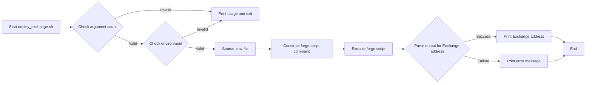
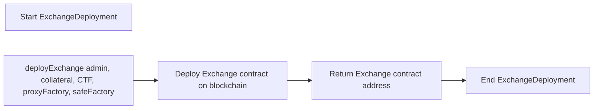
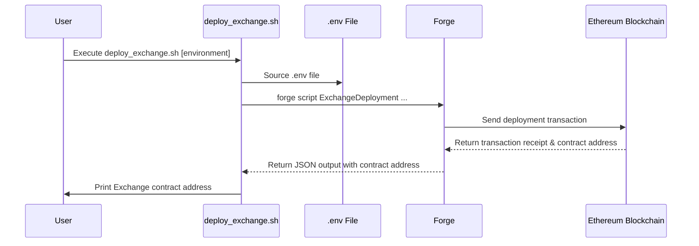

# CTF Exchange Deployment Documentation

## Overall Overview:

This project focuses on deploying a CTF (Conditional Token Framework) Exchange smart contract. The core functionality is to deploy the Exchange contract to different environments (local, testnet, mainnet) using a deployment script and environment-specific configurations. The script uses `forge`, a command-line tool for developing and deploying smart contracts, to automate the deployment process. The script takes an environment argument, sources the corresponding `.env` file, and then calls the `ExchangeDeployment` script with the necessary parameters such as admin address, collateral address, Conditional Tokens Framework address, proxy factory address, and safe factory address.  The script interacts primarily with the Ethereum blockchain via RPC calls using `forge`. The environment-specific `.env` files hold the deployment parameters like private keys and RPC URLs. The overall goal is to provide a streamlined and configurable way to deploy the CTF Exchange contract across different environments.

## File/Module-Level Details:

*   **File:** `deploy/scripts/deploy_exchange.sh`
    *   **Language:** Bash
    *   **Description:** This script is the entry point for deploying the CTF Exchange contract. It takes an environment argument (local, testnet, or mainnet), sources the corresponding `.env` file, and executes the `forge script` command to deploy the contract.
    *   **Notable Patterns/Design Decisions:** The script uses environment variables for configuration, making it easy to deploy to different networks without modifying the script itself. The script checks for the correct number of arguments and exits if they're missing. Error handling is present via argument validation. It leverages `jq` to parse JSON output from `forge` and extract the deployed contract address.
    *   **Dependencies:** This script depends on `forge`, `jq`, and environment variables defined in the `.env` files.

*   **File:** `.env.local`, `.env.testnet`, `.env`, (Example `.env.local`)
    *   **Language:** Environment Variable File (Bash-like)
    *   **Description:** These files contain environment-specific configurations, such as the private key (`PK`), RPC URL (`RPC_URL`), and contract addresses for admin, collateral, CTF, proxy factory, and safe factory.
    *   **Notable Patterns/Design Decisions:** This approach separates configuration from code, making the deployment process more flexible and secure.  Sensitive information like the private key is stored separately.
    *   **Dependencies:**  The deployment script depends on these files for configuration. Example content of `.env.local`:
        ```
        ADMIN=0xf39Fd6e515Eab6536698F5f9bA7d8dD7990D8E94
        COLLATERAL=0x9fE46736679d2D90B65E393061a4b906Ef32c09
        CTF=0x5FbDB2315678afecb367f032d93F642f64180aa3
        PROXY_FACTORY=0xe7f1725E7734CE288F8367e1Bb143E90bb3F0512
        SAFE_FACTORY=0xCf7Ed3AccA5a467e9e704C703688954BeFaB0cda
        PK=0xac0974bec39a17e36ba4a6b4d238ff944bacb478cbed5efcae784d7bf4f2ff80
        RPC_URL=http://127.0.0.1:8545
        ```

*   **Module:** `ExchangeDeployment` (Solidity Script - assumed, as invoked by forge)
    *   **Language:** Solidity
    *   **Description:** This script (Solidity code invoked by `forge script`) contains the logic for deploying the Exchange contract. It receives addresses for admin, collateral, CTF, proxy factory and safe factory and deploys the exchange contract using these addresses.
    *   **Notable Patterns/Design Decisions:** Uses `forge script` for deployment, presumably utilizes libraries to make deployment cleaner.
    *   **Dependencies:** Depends on Solidity compiler, and the Exchange smart contract itself.

## Key Functions and Components:

*   **`deploy_exchange.sh` (Bash Script):** This is the main driver for the deployment process. It orchestrates the execution of the `forge script` command with the correct parameters.
    *   It parses command line arguments to determine the target environment.
    *   It sources the corresponding `.env` file to load environment variables.
    *   It executes the `forge script` command, passing in the necessary parameters.
    *   It parses the output of the `forge script` command to extract the deployed contract address.
    *   It prints the deployed contract address to the console.
    *   It uses conditionals (`if`, `elif`, `else`) to manage different environments and validate arguments.
    *   It uses string manipulation (e.g., `grep`, `jq`) to process the output of the `forge script` command.

*   **`ExchangeDeployment` (Solidity Script):** This script (not explicitly shown in the provided code but invoked by the bash script) likely contains a `deployExchange` function.
    *   **`deployExchange(address admin, address collateral, address CTF, address proxyFactory, address safeFactory)`:**  This function (in the solidity script) would be responsible for deploying the Exchange contract, passing in the necessary constructor arguments.  It interacts with the Ethereum blockchain to deploy the contract.  It uses the `create` opcode to deploy the contract.

## Implementation Details:

*   **Error Handling:** The script includes basic error handling by checking the number of command-line arguments. If the incorrect number of arguments is provided, the script prints a usage message and exits. It also checks if the provided environment is valid. `forge` itself also has error handling capabilities.
*   **File Structure Conventions:** The project follows a simple file structure with a `deploy/scripts` directory for the deployment script and `.env` files for environment-specific configurations.
*   **Data Flows:**
    1.  The user executes the `deploy_exchange.sh` script with the environment as an argument.
    2.  The script validates the environment argument.
    3.  The script sources the corresponding `.env` file.
    4.  The script constructs the `forge script` command with the loaded environment variables.
    5.  The `forge script` command executes the `ExchangeDeployment` Solidity script.
    6.  The `ExchangeDeployment` script deploys the Exchange contract to the specified network using the provided addresses.
    7.  `forge` returns a JSON object containing the deployment information, including the contract address.
    8.  The script parses the JSON output to extract the Exchange contract address.
    9.  The script prints the Exchange contract address to the console.

## Visual Diagrams:

### Flowcharts:

**1. Deployment Script Flow:**



**2. `ExchangeDeployment` Script Dataflow**



### Sequence Diagrams:

**1. Deployment Sequence:**



There are no database diagrams as there's no database interaction in the current codebase.
```
