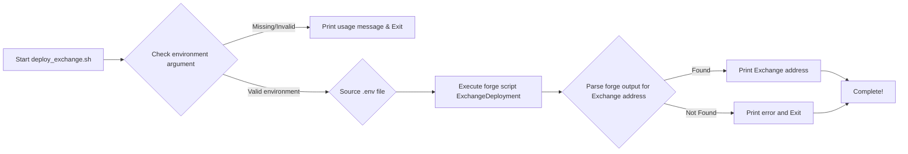
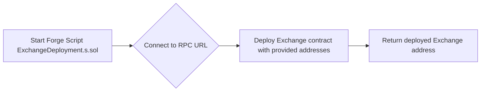
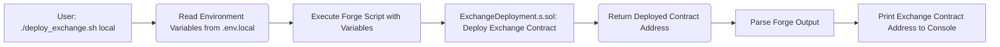
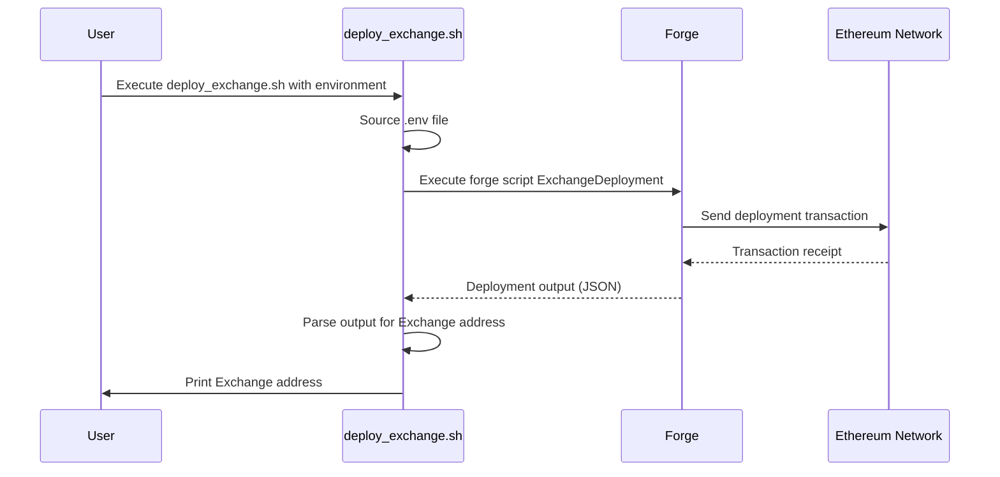

# CTF Exchange Deployment Documentation

## Overall Overview:

This project focuses on deploying a CTF (Conditional Token Framework) Exchange smart contract to various Ethereum environments (local, testnet, mainnet). The deployment process is automated using a bash script (`deploy_exchange.sh`) that takes the target environment as an argument and utilizes `forge` (from the Foundry toolchain) to execute a deployment script written in Solidity.  The script sources environment-specific variables from `.env` files to configure the deployment with the appropriate addresses and private keys.

The core functionality revolves around deploying the Exchange contract using specific addresses like Admin, Collateral, ConditionalTokensFramework, ProxyFactory and SafeFactory. The script ensures that the deployment is configured with the correct parameters based on the target environment.

The interaction between the bash script and the Solidity deployment script is as follows:

1.  The bash script determines the environment and sources the corresponding `.env` file.
2.  It then calls the `forge script` command, passing in the necessary parameters, including the private key, RPC URL, and contract addresses.
3.  `forge` executes the Solidity script, which deploys the Exchange contract.
4.  The bash script parses the output of the `forge` command to extract the deployed contract address.
5.  Finally, the script prints the deployed Exchange address to the console.

## File/Module-Level Details:

*   **File:** `deploy/scripts/deploy_exchange.sh`
    *   **Language:** Bash
    *   **Description:** This script automates the deployment of the CTF Exchange smart contract to different environments (local, testnet, mainnet). It takes the environment as a command-line argument, sources the corresponding `.env` file, and uses `forge` to execute the `ExchangeDeployment` Solidity script.
    *   **Functionality:**
        *   Parses command-line arguments to determine the deployment environment.
        *   Sources the appropriate `.env` file based on the environment.
        *   Executes the `forge script` command to deploy the Exchange contract with the specified parameters.
        *   Parses the output of the `forge` command to extract the deployed Exchange contract address.
        *   Prints the deployed Exchange contract address to the console.
    *   **Notable Patterns/Design Decisions:**
        *   Uses environment variables to configure the deployment for different environments.
        *   Employs `forge` for contract deployment, enabling gas price control and broadcasting transactions.
        *   Leverages `jq` to parse the JSON output from `forge`.
    *   **Dependencies:**
        *   `forge` (from the Foundry toolchain)
        *   `jq`
        *   Environment variables defined in `.env` files (`.env.local`, `.env.testnet`, `.env`)

*   **File:** `.env.local`, `.env.testnet`, `.env` (example contents below)
    *   **Language:** Environment variable definition file
    *   **Description:** These files store environment-specific configuration variables for the CTF Exchange deployment, such as the admin address, collateral address, CTF address, proxy factory address, safe factory address, private key, and RPC URL.
    *   **Functionality:**
        *   Provide configuration data to the `deploy_exchange.sh` script.
    *   **Notable Patterns/Design Decisions:**
        *   Uses separate `.env` files for different environments to maintain configuration isolation.
        *   Stores sensitive information like private keys as environment variables.
    *   **Dependencies:**
        *   `deploy_exchange.sh` script.

    **Example `.env.local` content:**

    ```
    ADMIN="0xf39Fd6e51BAb7f52E64241590229c4aD2594327b"
    COLLATERAL="0x5FbDB2315678afecb367f032d93F642f64180aa3"
    CTF="0xe7f1725E7734CE288F8367e1Bb143E90bb3F0512"
    PROXY_FACTORY="0xCf7Ed3AccA5a467e9e704C7036889549224Eb252"
    SAFE_FACTORY="0xDc64a140Aa3E981100a9becA4E685f962f0cF6C9"
    PK="0xac0974bec39a17e36ba4a6b4d238ff944bacb478cbed5efcae784d7bf4f2ff80"
    RPC_URL="http://127.0.0.1:8545/"
    ```

*   **File:** `ExchangeDeployment.s.sol` (Assumed, based on `forge script ExchangeDeployment`)
    *   **Language:** Solidity
    *   **Description:** This Foundry script (identified as `ExchangeDeployment`) contains the logic for deploying the CTF Exchange contract.  It takes the necessary contract addresses as input and deploys the Exchange contract with those addresses.
    *   **Functionality:**
        *   Deploys the Exchange smart contract.
        *   Accepts constructor arguments for the Exchange contract (Admin, Collateral, CTF, ProxyFactory, SafeFactory).
    *   **Notable Patterns/Design Decisions:**
        *   Utilizes the Foundry scripting functionality for automated deployments.
    *   **Dependencies:**
        *   Exchange.sol (The smart contract being deployed)
        *   Foundry

## Key Functions and Components:

*   **`deploy_exchange.sh` (Bash Script):**
    *   This script serves as the entry point for deploying the CTF Exchange contract. It orchestrates the deployment process by sourcing environment variables, executing the `forge script` command, and extracting the deployed contract address.
    *   It contributes to the project's objectives by automating the deployment process, making it easier to deploy the Exchange contract to different environments.
*   **`ExchangeDeployment.s.sol` (Solidity Script):**
    *   This script contains the Solidity code that performs the actual deployment of the Exchange contract. It takes the required contract addresses as input and deploys the contract with those addresses.
    *   It contributes to the project's objectives by defining the deployment logic for the Exchange contract.
*   **Exchange Contract (Solidity):**
    *   This is the core contract being deployed.  It's responsible for the logic of the CTF exchange. The deployment script sets up its constructor with the addresses of its dependencies.

## Implementation Details:

*   **Error Handling:**
    *   The `deploy_exchange.sh` script includes basic error handling by checking if the environment argument is provided and valid. If not, it prints a usage message and exits. `forge` will return a non-zero exit code on deployment failure, which the bash script doesn't explicitly check, but would cause the script to halt unless `set -e` is disabled.
*   **File Structure Conventions:**
    *   The project follows a convention of using separate `.env` files for different environments (local, testnet, mainnet). This allows for easy configuration of the deployment for each environment.
    *   The deployment script is located in the `deploy/scripts` directory.
*   **Data Flows:**
    *   The data flow starts with the user executing the `deploy_exchange.sh` script with the desired environment as an argument.
    *   The script then reads the environment variables from the corresponding `.env` file.
    *   These environment variables are passed as arguments to the `forge script` command.
    *   `forge` executes the `ExchangeDeployment.s.sol` script, which deploys the Exchange contract to the specified RPC URL.
    *   The deployed contract address is returned by the `forge` command.
    *   The `deploy_exchange.sh` script parses the output of the `forge` command to extract the deployed contract address.
    *   Finally, the script prints the deployed Exchange contract address to the console.

## Visual Diagrams:

### Flowcharts:

#### 1. `deploy_exchange.sh` Script Flow



#### 2. Forge Script Execution Flow



#### 3.  End to End Data Flow



### Sequence Diagrams:

#### 1. Deployment Sequence



### Database Diagrams:

This project primarily involves smart contract deployment, and doesn't directly interact with a traditional database. However, if the Exchange contract stores data on-chain, the Ethereum blockchain could be considered a distributed database. There's no specific schema diagram to provide in this context.
```
