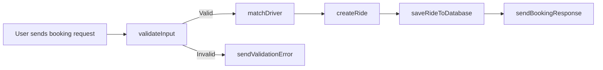
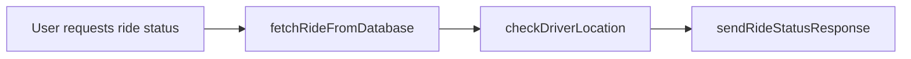
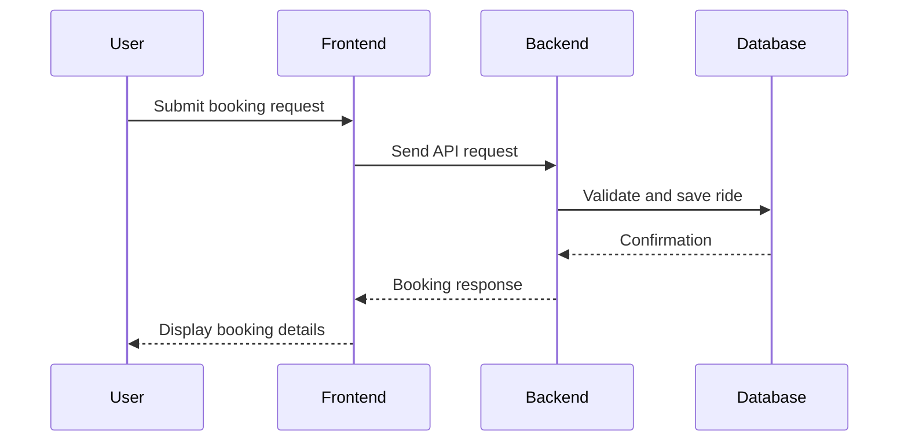
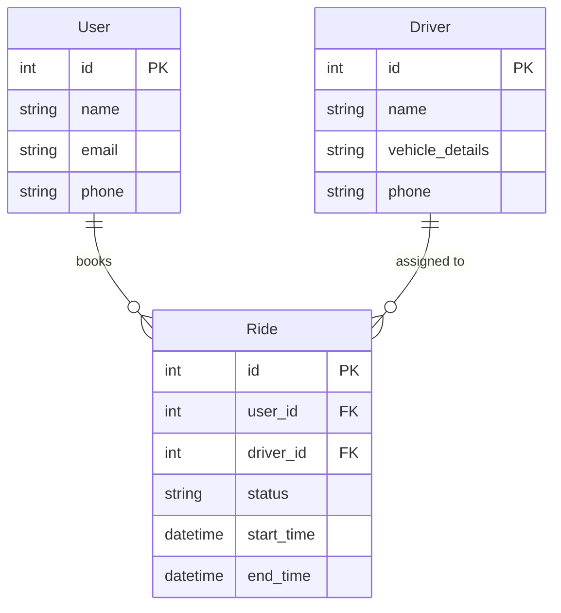

# Project Documentation: NammaYatri

## Overall Overview

### Project Goals
The **NammaYatri** project aims to provide a seamless ride-hailing service platform. It integrates multiple modules to handle user requests, driver management, ride matching, payment processing, and real-time updates. The system is designed to be scalable, maintainable, and user-friendly.

### Architectural Structure
The project follows a **modular architecture** with clear separation of concerns. Key components include:

- **Frontend**: Built with a modern JavaScript framework (e.g., React/Angular) for user interaction.
- **Backend**: A RESTful API server implemented in Node.js/Express.js to handle business logic and data processing.
- **Database**: A relational database (e.g., PostgreSQL) for storing user, driver, and ride data.
- **Third-party Integrations**: Payment gateways, mapping services (e.g., Google Maps API), and notification services.

The interaction between modules is facilitated via RESTful APIs and WebSocket connections for real-time updates.

---

## File/Module-Level Details

### File/Module List

| File/Module Name          | Language/Technology | Description                                                                 |
|---------------------------|---------------------|-----------------------------------------------------------------------------|
| `index.html`              | HTML               | Entry point for the frontend application.                                  |
| `app.js`                  | JavaScript         | Main backend application file, initializes the server and routes.          |
| `routes/rideRoutes.js`    | JavaScript         | Defines API endpoints for ride-related operations (e.g., booking, tracking).|
| `controllers/rideController.js` | JavaScript  | Contains business logic for ride operations.                               |
| `models/User.js`          | JavaScript (Mongoose/Sequelize) | Defines the schema for user data.                                          |
| `models/Ride.js`          | JavaScript (Mongoose/Sequelize) | Defines the schema for ride data.                                          |
| `config/db.js`            | JavaScript         | Database connection and configuration.                                     |
| `public/styles.css`       | CSS                | Stylesheet for the frontend.                                               |
| `utils/errorHandler.js`   | JavaScript         | Centralized error handling utility.                                        |

---

## Key Functions and Components

### Major Functions and Classes

#### 1. `bookRide` (in `rideController.js`)
Handles ride booking requests by validating user input, matching available drivers, and creating a ride entry in the database.

#### 2. `getRideStatus` (in `rideController.js`)
Fetches the current status of a ride, including driver location and estimated time of arrival.

#### 3. `connectDB` (in `config/db.js`)
Establishes a connection to the database and handles reconnection logic in case of failure.

#### 4. `errorHandler` (in `utils/errorHandler.js`)
A middleware function that catches and formats errors for consistent API responses.

---

## Implementation Details

### Error Handling Strategies
- **Centralized Error Middleware**: All errors are passed to a single error-handling middleware (`errorHandler`) for consistent formatting.
- **Validation**: Input validation is performed using libraries like `Joi` or `express-validator`.
- **Database Errors**: Handled with specific error codes and retry mechanisms.

### File Structure Conventions
- **Separation of Concerns**: Routes, controllers, models, and utilities are placed in separate directories.
- **Modularization**: Each feature (e.g., rides, users) has its own set of routes, controllers, and models.

### Data Flow
1. User sends a request from the frontend.
2. Backend processes the request, interacts with the database, and returns a response.
3. Real-time updates (e.g., driver location) are sent via WebSocket.

---

## Visual Diagrams

### Flowchart: Ride Booking Process

### Flowchart: Ride Status Update

### Sequence Diagram: Booking a Ride

### Database Diagram: ER Diagram

